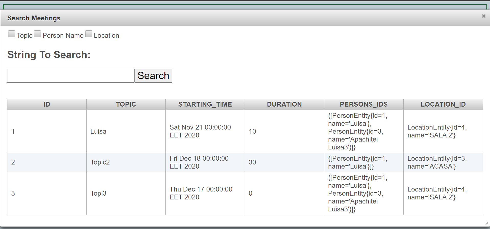
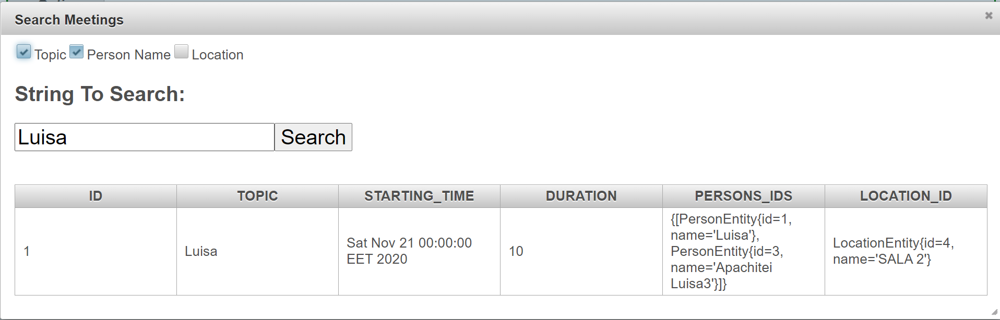
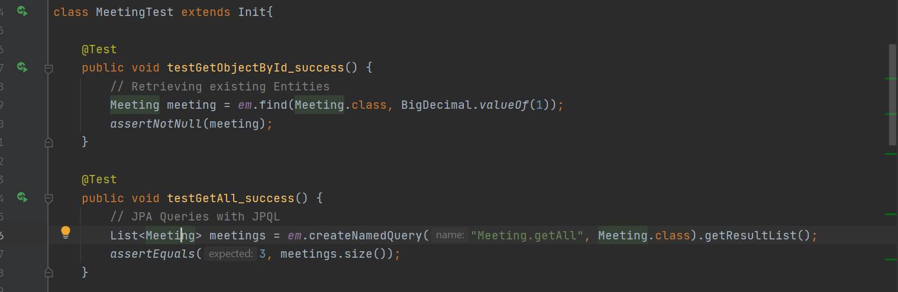
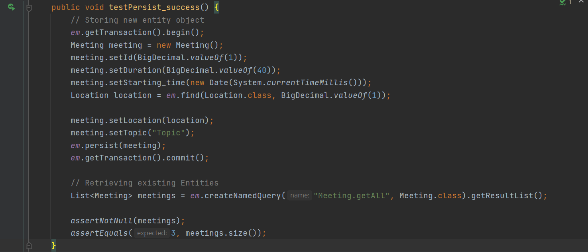
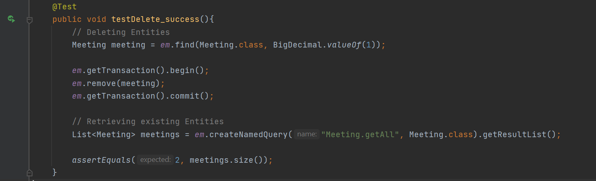

# Laboratorul 6

## Exercitiul 1
	- Definirea unui persistence unit : `src\main\resources\META-INF\persistence.xml`
	- Crearea de EntityManager pentru preluarea de tranzactii (/DBConnection/DBActions.java) 
	- Entitatile (/Entities) implementeaza JPA-only annotations si JPAQL in crearea de query-uri (cu exceptia Search Meeting)

## Exercitiul 2
	- Inheritance Mapping - Create entitatile Workshop & Conference extinzand entitatea Meeting
	- Se foloseste DiscriminatorColumn (o coloana a carei valoare va face diferentierea dintre entitati)
	- `@DiscriminatorColumn(discriminatorType = DiscriminatorType.STRING,name = "meeting_type")`
	- Fiecare entitate isi seteaza valoarea : `@DiscriminatorValue("conference")` 
    
## Exercitiul 3
	- Searching page for meetings : search_meetings.xhtml
	- Contine un checkbox (mai multe din cele 3 optiuni pot fi selectate : Topic, Person Name, Location Name)
	- Implementarea search-ului s-a facut folosind JPA Criteria API, concatenand la un Predicat (conditii - pentru implementare `where`) in functie de checkbox-ul selectat

## Exercitiul 4
	- Teste pentru Operatiile CRUD (In comentarii sunt mentionate operatiile testate) 
	- Toate rulate si reusite:

